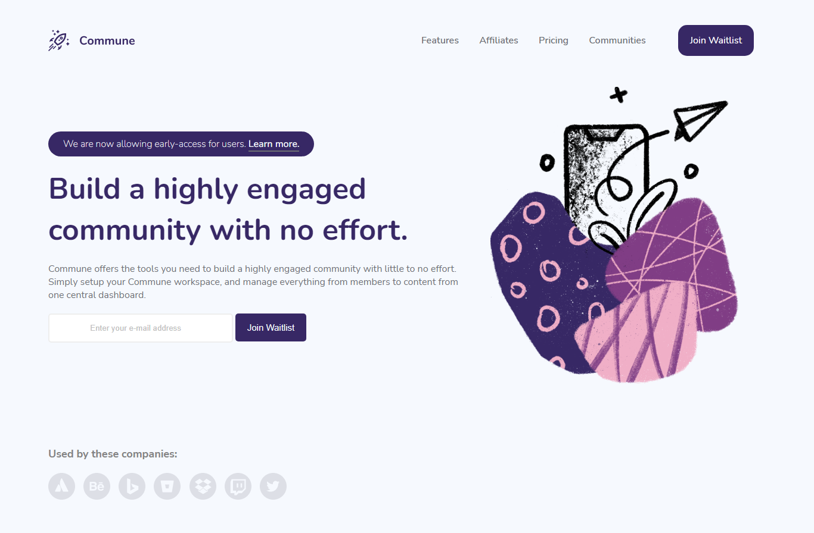

# Commune Waitlist Landing Page

## Table of contents

- [Overview](#overview)
  - [The challenge](#the-challenge)
  - [Screenshot](#screenshot)
  - [Links](#links)
- [My process](#my-process)
  - [Built with](#built-with)
  - [What I learned](#what-i-learned)
  - [Continued development](#continued-development)
- [Author](#author)

## Overview

### The challenge

- View the optimal layout for the site depending on their device's screen size
- Set hover states for all interactive elements on the page
- Submit their email address using an `input` field
- Build a responsive navigation that works on screen size
- Hide the image on smaller screens.

### Screenshot

### Links

- Repo link: [Github Repo](https://github.io/GentryHQ)
- Live link: [Github Page](https://github.io/GentryHQ)

## My Process

### Built With
- Semantic HTML5 markup
- Flexbox
- CSS Grid
- Vanilla Javascript

### What I learned

- I really learnt how to be more patient with myself and my code. After writing the Javascript for the toggle function for smaller screens, the code didn't work. I did all the debugging I could but I couldn't get it to work. It took me about a week to find out in JS file while referencing some HTML element I actually misspelt `getElementById` as `getElement*s*ById`. What a subtle mistake!

- While debugging why Nav toggle wasn't working, I learnt different method to make a nav work.

### Continued development

I actually will be doing more with Javascript in the future.

## Author

- Website - [Gentry.com.ng](https://www.gentry.com.ng)
- Linkedin - [Afolabi John Ayooluwa](https://www.linkedin.com/in/afolabi-john-ayooluwa)
- Twitter - [@iam_gentry](https://www.twitter.com/iam_gentry)
